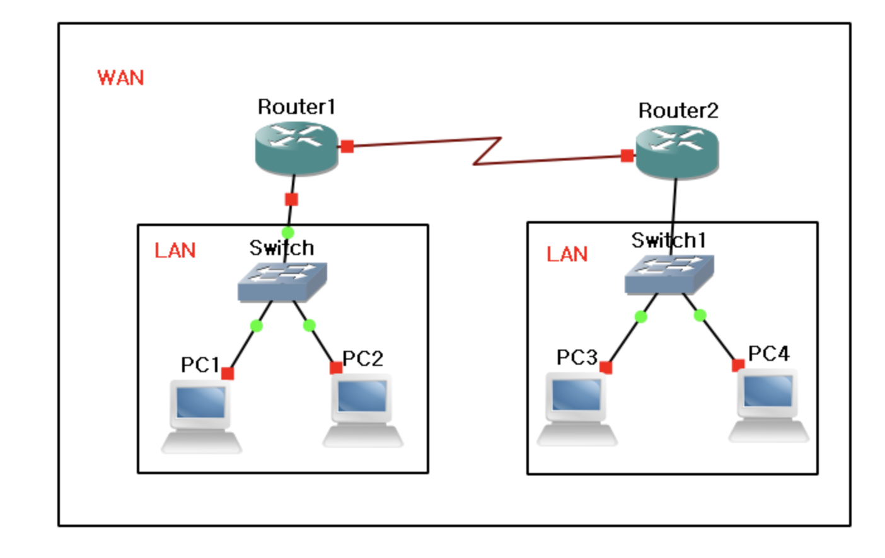
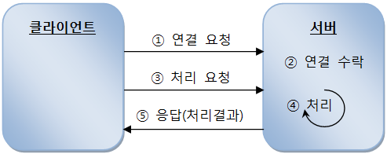
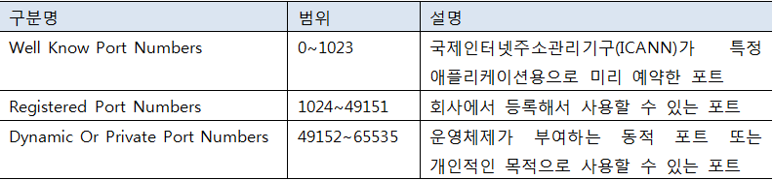

## 1. 네트워크 기초

 

네트워크는 여러 컴퓨터들을 통신 회선으로 연결한 것을 말한다.

LAN(Local Area Network)은 가정, 회사, 건물, 틀정 영역에 존재하는 컴퓨터를 연결한 것이고,

WAN(Wide Area Network)은 LAN을 연결한 것이다. WAN이 우리가 흔히 말하는 인터넷이다.

 

 

### 서버와 클라이언트

 

네트워크에서 유무선으로 컴퓨터가 연결되어 있다면 실제로 데이터를 주고받는 행위는 프로그램들이 한다.
서비스를 제공하는 프로그램을 일반적으로 서버(Server)라고 부르고, 서비스를 요청하는 프로그램을 클라이언트(Client)라고 부른다.
인터넷에서 두 프로그램이 통신하기 위해서는 먼저 클라이언트가 서비스를 요청하고, 서버는 처리 결과를 응답으로 제공해 준다.

 

 

### IP 주소

 

집에는 고유한 주소가 있기 때문에 우편물이나 택배물이 정확하게 집을 찾아간다.
컴퓨터에도 고유한 주고사 있다. 바로 IP(Internet Protocol)주소이다. IP 주소는 네트워크 어댑터(LAN카드)마다 할당을 받을 수 있다.

IP 주소는 xxx.xxx.xxx.xxx와 같은 형식으로 출력되며 여기서 xxx는 부호없는 0~255 사이의 정수이다.

연결할 상대방 컴퓨터의 IP주소를 모르면 프로그램들은 서로 통신할 수 없다.
우리가 전화번호를 모르면 114로 문의하듯이 프로그램은 DNS(Domain Name System)를 이용해서 컴퓨터의 IP 주소를 검색한다.

여기에서 DNS는 도메인 이름으로, IP를 등록하는 저장소이다. 대중에게 서비스를 제공하는 대부분의 컴퓨터는 다음과같이 도메인 이름으로 IP를 DNS에 미리 등록해 놓는다.

 

| 도메인 이름 | IP 주소 |
| ------ | --- |
| www.naver.com | 222.122.195.7 |
| www.daum.net | 180.70.93.57 |

 

웹 브라우저는 웹 서버와 통신하는 클라이언트로, 사용자가 입력한 도메인 이름으로 DNS에서 IP 주소를 검색해 찾은 다음 웹 서버와 연결해서 웹 페이지를 받는다.

 

### Port 번호

 

한 대의 컴퓨터에는 다양한 서버 프로그램들이 실행될 수 있다.
예를 들어 웹(Web) 서버, 데이터베이스 관리 시스템(DBMS), FTP 서버 등이 하나의 IP 주소를 갖는 컴퓨터에서 동시에 실행 될 수 있다.
이 경우 클라이언트는 어떤 서버와 통신해야 할지 결정해야 한다. IP는 컴퓨터의 네트워크 어댑터까지만 갈 수 있는 정보이기 때문에, 컴퓨터 내부에서 실행하는 서버를 선택하기 위해서는 추가적인 Port 번호가 필요하다.

Port는 운영체제가 관리하는 서버 프로그램의 연결 번호이다. 서버는 시작할 때 특정 Port 번호에 바인딩한다. 예를 들어 웹 서버는 80번으로,
DBMS는 1521번으로 바인딩할 수 있다. 따라서 클라이언트가 웹 서버와 통신하려면 80번으로, DBMS와 통신하라면 1521번으로 요청을 해야한다.

클라이언트도 서버에서 보낸 정보를 받기 위해서는 Port 번호가 필요한데, 서버와 같이 고정적인 Port 번호에 바인딩하는 것이 아니라 운영체제가 자동으로 부여하는 번호를 사용한다. 이 번호는 클라이언트가 서버로 요청할 때 함께 전송되어 서버가 클라이언트로 데이터를 보낼 때 사용된다.

프로그램에서 사용할 수 있는 전체 Port 번호의 범위는 0 ~ 65535로, 다음과 같이 사용 목적에 따라 세 가지 범위를 갖는다.

 

 

---
