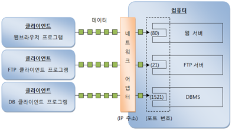

## 2. IP 주소 얻기

자바는 IP 주소를 java.net 패키지의 InetAddress로 표현한다. InetAddress를 이용하면 로컬 컴퓨터의 IP 주소를 얻을 수 있고, 도메인 이름으로 DNS에서 검색한 후 IP 주소를 가져올 수도 있다.
로컬 컴퓨터의 InetAddress를 얻고 싶다면 InetAddress.getLocalHost() 메소드를 다음과 같이 호출하면 된다.

> InetAddress ia = InetAddress.getLocalHost()

만약 컴퓨터의 도메인 이름을 알고 있다면 다음 두 개의 메소드를 사용하여 InetAddress 객체를 얻을 수 있다.

> InetAddress ia = InetAddress.getByName(String domainName);
> InetAddress[] iaArr = InetAddress.getAllByName(String domainName);

getByName() 메소드는 DNS에서 도메인 이름으로 등록된 단 하나의 IP 주소를 가져오고, getAllByName() 메소드는 등록된 모든 IP 주소를 배열로 가져온다.
하나의 도메인 이름으로 여러 IP가 등록되어 있는 이유는 클라이언트가 많이 연결되었을 경우 서버 부하를 나누기 위해서이다.

이 메소들로부터 얻은 InetAddress 객체에서 IP 주소를 얻으려면 getHostAddress() 메소드를 다음과 같이 호출하면 된다. 리턴값은 문자열로 된 IP 주소이다.

> String ip = InetAddress.getHostAddress();

코드 보기 : [InternetProtocol.java](https://github.com/atimaby28/Network-with-Java/blob/main/1_java/Network/src/ip/InternetProtocol.java)