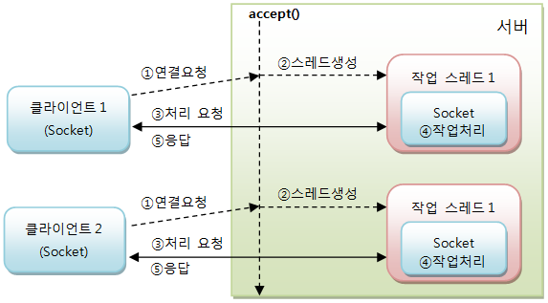

## 5. 서버의 동시 요청 처리

일반적으로 서버는 다수의 클라이언트와 통신을 한다. 서버는 클라이언트들로부터 동시에 요청을 받아서 처리하고, 처리 결과를 개별 클라이언트로 보내줘야 한다.
앞선 예제에서는 먼저 연결한 클라이언트의 요청을 처리한 후, 다음 클라이언트의 요청을 처리하도록 되어 있다.

다음은 EchoServer의 동작 방식이다.


``` Java

1. 연결 요청 수락 및 요청처리
2. 다음 연결 수락 및 요청 처리를 위한 반복

while(true) {
    // 연결 수락
    Socket socket = serverSocket.accept();

    // 데이터 받기
    ...
    // 데이터 보내기
    ...
}

```

다음은 NewsServer의 동작 방식이다.

``` Java

1. 요청 내용 받기 및 요청처리
2. 다음 요청 내용 받기 및 요청 처리를 위한 반복

while(true) {
    // 클라이언트가 구독하고 싶은 뉴스 종류 얻기
    DatagramPacket receivePacket = new DatagramPacket(new byte[1024], 1024);
    datagramSocket.receive(receivePacket);

    ...

    // 10개의 뉴스를 클라이언트로 전송
    ...
}

```

이와 같은 방식은 먼저 연결한 클라이언트의 요청 처리 시간이 길어질수록 다음 클라이언트의 요청처리 작업이 지연될 수 밖에 없다. 따라서 accept()와 receive()를 제외한 요청 처리 코드를 별도의 스레드에서 작업하는 것이 좋다.

``` Java

while(true) {
    // 연결 수락
    Socket socket = serverSocket.accept();

    이 부분을 스레드로 처리
    /* 
 
    // 데이터 받기
    ...
    // 데이터 보내기
     ...
    */

}

```

``` Java

1. 요청 내용 받기 및 요청처리
2. 다음 요청 내용 받기 및 요청 처리를 위한 반복

while(true) {
    // 클라이언트가 구독하고 싶은 뉴스 종류 얻기
    DatagramPacket receivePacket = new DatagramPacket(new byte[1024], 1024);
    datagramSocket.receive(receivePacket);

    ...

    이 부분을 스레드로 처리
    /* 
    // 10개의 뉴스를 클라이언트로 전송
    ...
     */
}

```




스레드를 처리할 때 주의할 점은 클라이언트의 폭증으로 인한 서버의 과도한 스레드 생성을 방지해야 한다는 것이다. 그래서 스레드풀을 사용하는 것이 바람직하다.
다음은 스레드풀을 이용해서 요청을 처리하는 방식이다.

스레드풀은 작업 처리 스레드 수를 제한해서 사용하기 때문에 갑작스런 클라이언트 폭증이 발생해도 크게 문제가 되지 않는다.
다만 작업 큐의 대기 작업이 증가되어 클라이언트에서 응답을 늦게 받을 수 있다.


### TCP EchoServer 동시 요청 처리

TCP 서버인 EchoServer를 수정한 것으로, 스레드풀을 이용해서 클라이언트의 요청을 동시에 처리하도록 했다.


### UDP NewsServer 동시 요청 처리

UDP 서버인 NewsServer를 수정한 것으로, 스레드풀을 이용해서 클라이언트의 요청을 동시에 처리하도록 하였다.


