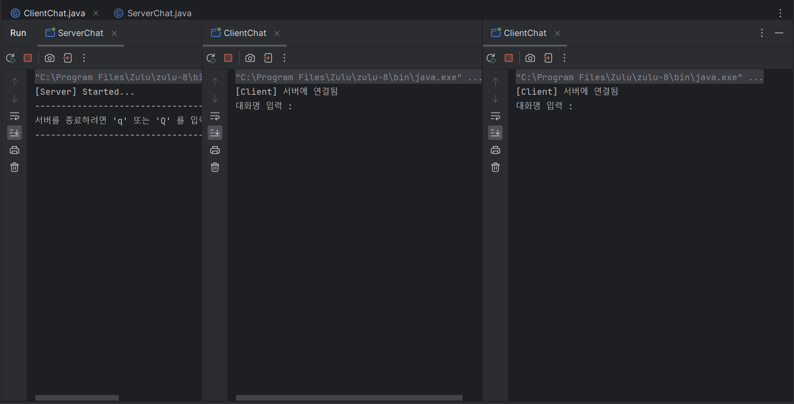
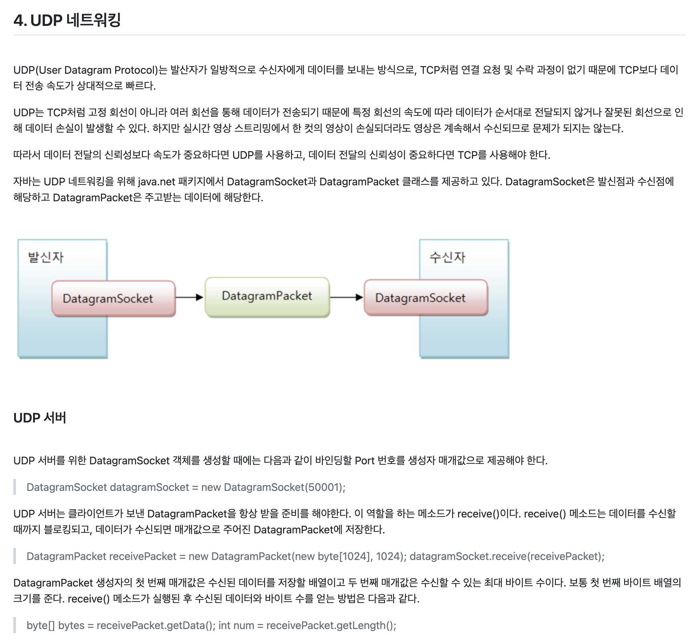

# Network-with-Java

 

## 🥕 Java로 구현한 채팅 애플리케이션

 

 

**1_java** chatting 파일 아래에 코드가 있습니다. < 이것이 자바다 > 책을 참고 하였으며, IP를 확인하는 부분부터 TCP와 UDP 기본 예제를 실습해 보며 
채팅 서버를 구현하는 데 까지 기록해 두었습니다. 첨부한 JSON jar 파일을 라이브러리에 추가해서 실행해야 하며, **3_note**에는 네트워크와 스레드 프로그램을 공부하기 위해 Markdown 형식으로 기록해 두었습니다.

 

 

## Reference

- 이것이 자바다, 신용권,임경균 著