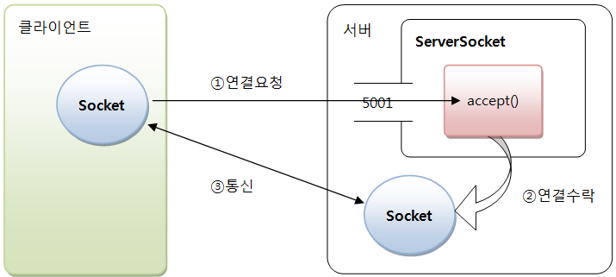

## 3. TCP 네트워킹

<br>

IP 주소로 프로그램들이 통신할 때는 약속된 데이터 전송 규약이 있다. 이것을 전송용 프로토콜(protocol)이라고 부른다.
인터넷에서 전송용 프로토콜은 TCP(Transmission Control Protocol)와 UDP(User Datagram Protocol)가 있다.

TCP는 연결형 프로토콜로, 상대방이 연결된 상태에서 데이터를 주고 받는다.
클라이언트가 연결 요청을 하고 서버가 연결을 수락하면 통신 회선이 고정되고, 데이터는 고정 회선을 통해 전달된다.
그렇기 때문에 TCP는 보낸 데이터가 순서대로 전달되며 손실이 발생하지 않는다.

TCP는 IP와 함께 사용하기 때문에 TCP/IP라고도 한다. TCP는 웹 브라우저가 웹 서버에 연결할 때 사용되며 이메일 전송, 파일 전송, DB 연동에도 사용된다.

자바는 TCP 네트워킹을 위해 java.net 패키지에서 ServerSocket과 Socket 클래스를 제공하고 있다.
ServerSocket은 클라이언트의 연결을 수락하는 서버 쪽 클래스이고, Socket은 클라이언트에서 연결 요청할 때와 클라이언트와 서버 양쪽에서 데이터를 주고 받을 때 사용되는 클래스이다.

<br>



<br>

ServerSocket을 생성할 때는 바인딩할 Port 번호를 지정해야 한다. 위 그림에서는 50001번이 Port이다.
서버가 실행되면 클라이언트는 Socket을 이용해서 서버의 IP 주소와 Port 번호로 연결 요청을 할 수 있다. ServerSocket은 accept() 메소드로 연결 수락을 하고 통신용 Socket을 생성한다. 그리고 나서 클라이언트와 서버는 양쪽의 Socket을 이용해서 데이터를 주고받게 된다.

<br>

### TCP 서버

<br>

TCP 서버 프로그램을 개발하려면 우선 ServerSocket 객체를 생성해야 한다. 다음은 50001번 Port에 바인딩하는 ServerSocket를 생성하는 코드이다.

> ServerSocket serverSocket = new ServerSocket(50001);

ServerSocket을 생성하는 또 다른 방법은 기본 생성자로 객체를 생성하고 Port 바인딩을 위해 bind() 메소드를 호출하는 것이다.

> ServerSocket serverSocket = new ServerSocket();
> serverSocket.bind(new InetSocketAddress(50001));

만약 서버 컴퓨터에 여러 개의 IP가 할당되어 있을 경우, 특정 IP에서만 서비스를 하고 싶다면 InetSocketAddress의 첫 번째 매개값으로 해당 IP를 주면 된다.

> ServerSocket serverSocket = new ServerSocket();
> serverSocket.bind(new InetSocketAddress("xxx.xxx.xxx.xxx", 50001));

만약 Port가 이미 다른 프로그램에서 사용 중이라면 BindException이 발생한다. 이 경우에는 다른 Port로 바인딩하거나 Port를 사용 중인 프로그램을 종료하고 다시 실행하면 된다.

ServerSocket이 생성되었다면 연결 요청을 수락하기 위해 accept() 메소드를 실행하야 한다.
accept()는 클라이언트가 연결 요청하기 전까지 블로킹된다. 블로킹이란 실행을 멈춘 상태가 된다는 뜻이다. 클라이언트 연결 요청이 들어오면 블로킹이 해제되고 통신용 Socket을 리턴한다.

> Socket socket = serverSocket.accept();

만약 리턴된 Socket을 통해 연결된 클라이언트의 IP 주소와 Port 번호를 얻고 싶다면 방법은 getRemoteSocketAddress() 메소드를 호출해서 InetSocketAddress를 얻은 다음 getHostName()과 getPort() 메소드를 호출하면 된다.


> InetSocketAddress isa = (InetSocketAddress) socket.getRemoteSocketAddress();
> String clientIp = isa.getHostName();
> String portNo = isa.getPort();

서버를 종료하려면 ServerSocket의 close() 메소드를 호출해서 Port 번호를 언바인딩시켜야 한다.
그래야 다른 프로그램에서 해당 Port 번호를 재사용할 수 있다.

> serverSocket.close();

다음 예제는 반복적으로 accept() 메소드를 호출해서 클라이언트 연결 요청을 계속 수락하는 TCP 서버의 가장 기본적인 코드를 보여준다.

코드 보기 : [ServerTCP.java](https://github.com/atimaby28/Network-with-Java/blob/main/1_java/Network/src/tcp/ServerTCP.java)

<br>

### TCP 클라이언트

<br>

클라이언트가 서버에 연결 오청을 하려면 Socket 객체를 생성할 때 생성자 매개값으로 서버 IP 주소와 Port 번호를 제공하면 된다. 로컬 컴퓨터에서 실행하는 서버로 연결 요청을 할 경우에는 IP 주소대신 localhost를 사용할 수 있다.

만약 IP 주소대신 도메인 이름을 사용하고 싶다면, DNS에서 IP 주소를 검색할 수 있도록 생성자 매개값으로 InetAddress를 제공해야 한다.

> Socket socket = new Socket(InetAddress.getByName("domainName"), 50001);

Socket 생성과 동시에 연결 요청을 하지 않고 다음과 같이 기본 생성자로 Socket을 생성한 후 connet() 메소드로 연결 요청을 할 수도 있다.

> socket = new Socket();
> socket.connect(new InetSocketAddress("domainName",50001));

연결 요청 시 두 가지 예외가 발생할 수 있다. UnknownHostException은 IP 주소가 잘못 표기되었을 때 발생하고, IOException은 제공된 IP와 Port 번호로 연결할 수 없을 때 발생한다. 따라서 두 가지 예외를 모두 처리해야 한다.

``` Java
try {
    Socket socket = new Socket("IP", 50001);
} catch (UnkownHostException e) {
    // IP 표기 방법이 잘못 되었을 경우
} catch (IOException e) {
    // IP와 Port로 서버에 연결할 수 없는 경우
}
```

서버와 연결된 후에 클라이언트에서 연결을 끊고 싶다면 Socket의 close() 메소드를 다음과 같이 호출하면 된다.

socket.close();

다음은 이전 예제인 ServerExample에 연결 요청을 하는 TCP 클라이언트의 가장 기본적인 코드를 보여준다.


코드 보기 : [ClientTCP.java](https://github.com/atimaby28/Network-with-Java/blob/main/1_java/Network/src/tcp/ClientTCP.java)

<br>

### 입출력 스트림으로 데이터 주고 받기

<br>

클라이언트가 연결 요청(connect())을 하고 서버가 연결 수락(accept())했다면, 다음 그림과 같이 양쪽의 Socket 객제로부터 각각 입력 스트림(InputStream)과 출력 스트림(OutputStream)을 얻을 수 있다.

<br>


<br>

다음은 Socket으로부터 InputStream과 OutputStream을 얻는 코드이다.

> InputStream is = socket.getInputStream();
> OutputStream os = socket.getOutputStream();

상대방에게 데이터를 보낼 때에는 보낼 데이터를 byte[] 배열로 생성하고, 이것을 매개값으로 해서 OutputStream의 write() 메소드를 호출하면 된다.
다음 코드는 문자열로부터 UTF-8로 인코딩한 바이트 배열을 얻어내고, write() 메소드로 전송한다.

<br>

``` Java
String data = "보낼 데이터";
byte[] bytes = data.getBytes("UTF-8");
OutputStream os = socket.getOutputStream();
os.write(bytes);
os.flush();
```

<br>

문자열을 좀 더 간편하게 보내고 싶다면 보조 스트림인 DataOutputStream을 연결해서 사용하면 된다.

<br>

``` Java
String data = "보낼 데이터";
DataOutputStream dos = new DataOutputStream(socket.getOutputStream());
dos.writeUTF(data);
dos.flush();
```

<br>

데이터를 받기 위해서는 받은 데이터를 저장할 byte[] 배열을 하나 생성하고, 이것을 매개값으로 해서 InputStream의 read() 메소드를 호출하면 된다.
read() 메소드는 읽은 데이터를 byte[] 배열에 저장하고 읽은 바이트 수를 리턴한다. 받는 데이터가 문자열이라면 다음과 같이 byte[] 배열을 UTF-8로 디코딩해서 문자열로 얻을 수 있다.

<br>

``` Java
byte[] bytes = new byte[1024];
InputStream is = socket.getInputStream();
int num = is.read(bytes);
String data = new String(bytes, 0, num "UTF-8");
```

<br>

문자열을 좀 더 간편하게 받고 싶다면 보조 스트림인 DataInputStream을 연결해서 사용하면 된다.

> DataInputStream dis = new DataInputStream(socket.getInputStream());
> String data = dis.readUTF();

다음은 TCP 클라리언트가 보낸 메시지를 다시 돌려보내는 에코(메아리) TCP 서버를 구현한 예제이다.

코드 보기 : [Echo Examples](https://github.com/atimaby28/Network-with-Java/tree/main/1_java/Network/src/echo)

<br>

---

